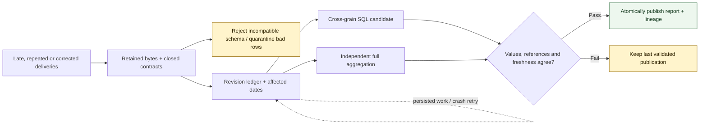

# MarTech Data Reliability

**Can Marketing trust its campaign report after feeds arrive late, repeat deliveries, change schemas, or correct last week's numbers?**

This executable warehouse pipeline keeps the original deliveries, explains rejected and quarantined data, and publishes a new report only after reconciliation. A failed load or rebuild leaves the previous publication available.

Start with the [executed result](docs/evidence/report.md). In the synthetic demonstration, corrected spend moves from **36,000 to 41,000 USD cents**, web conversions from **4 to 6**, and CRM revenue from **150,000 to 115,000 USD cents**. Each variance has a source-record explanation. A late lower revision cannot overwrite a newer correction. Missing campaign references and stale source coverage block publication.

**All data, source systems and business outcomes are synthetic. This is an independent engineering demonstration, not a client implementation or production experience claim.** Published totals exclude quarantined rows; the evidence reports those exclusions explicitly.



*Candidate computation and independent reconciliation are separate. Failure preserves the last publication; corrections never erase the original deliveries.*

## What runs

| Reliability problem | Executed behavior |
|---|---|
| File replay or repeated records | Stable delivery receipt; semantic row deduplication across deliveries |
| Bad rows or incompatible schema | Row quarantine versus whole-delivery rejection; original bytes retained |
| Late data, corrections and deletions | Highest source revision wins; old and new dates become rebuild candidates |
| Different source grains | SQL combines campaign/day measures without multiplying spend by event counts |
| Incomplete or stale inputs | Reference and declared-coverage gates block a new publication |
| Process termination | Eight real subprocess crash experiments reopen and retry persisted work |
| Historical rebuild | One-day and full rebuilds match an independent full Python aggregation |
| Equal counts, wrong values | Metric corruption fails reconciliation before publication |

Python handles admission and run transitions; **DuckDB executes the warehouse SQL and transactions**. The local landing directory preserves delivery bytes. No cloud account, database service, Docker engine or API key is required. [Architecture and tradeoffs](docs/architecture.md) explain the single-writer boundary and why this project uses explicit SQL rather than dbt or an orchestration service.

## Inspect the demonstration

- [Business result and explained variance](docs/evidence/report.md)
- [Delivery ledger, quarantine and published rows](docs/evidence/reconciliation.json)
- [Blocked runs, corrected publication and backfills](docs/evidence/pipeline-runs.json)
- [Actual process-death recovery](docs/evidence/recovery.json)
- [Record-level source lineage](docs/evidence/lineage.json)
- [Tests, environment and source hashes](docs/evidence/verification.json)

The [eight-minute walkthrough](docs/interview-walkthrough.md) follows these artifacts. [Portfolio positioning](docs/portfolio-positioning.md) explains the distinct proof: recurring source-to-warehouse reliability, alongside six projects focused on other engineering problems.

## Reproduce

Use **Python 3.12**, from the extracted repository directory:

```text
python -m venv .venv
```

Activate with `.venv\Scripts\Activate.ps1` in Windows PowerShell or `source .venv/bin/activate` on macOS/Linux. If activation is unavailable, use the environment's Python executable directly.

```text
python -m pip install -r requirements.lock
python -m pip install --no-deps --no-build-isolation .
python scripts/verify.py
```

Verification runs the full test suite, actual process crashes, two byte-compared demonstrations, dependency and style checks, wheel-content checks and internal Markdown links. It regenerates evidence and the package manifest. Every run uses a new ignored working directory and does not reset previous databases. For the story alone, run `python scripts/demo.py`. [Operations and individual commands](docs/operations.md).

## Important boundaries

This is a small, serialized local batch pipeline. Incremental processing selects affected dates, but each run copies its input snapshot and report, and validation performs a full independent scan. It is not a distributed throughput benchmark. Landing immutability is enforced by the application, not by access control against a filesystem administrator.

Freshness is measured at an explicit run date against **supplied coverage assertions**. It does not prove upstream completeness or automatically expire an already published report. Quarantined rows do not block publication; unresolved references in admitted data do. No causal attribution, identity resolution, activation, consent processing or live vendor connector is implemented.

Native Windows execution and an installed-wheel verification are recorded. **Hosted GitHub Actions verification passed on both Windows and Ubuntu for the published build.** The [AWS/Redshift translation](docs/cloud-translation.md) is design guidance only, with no cloud deployment claimed. Read the [review and limitations](docs/validation.md) before interpreting the evidence.
